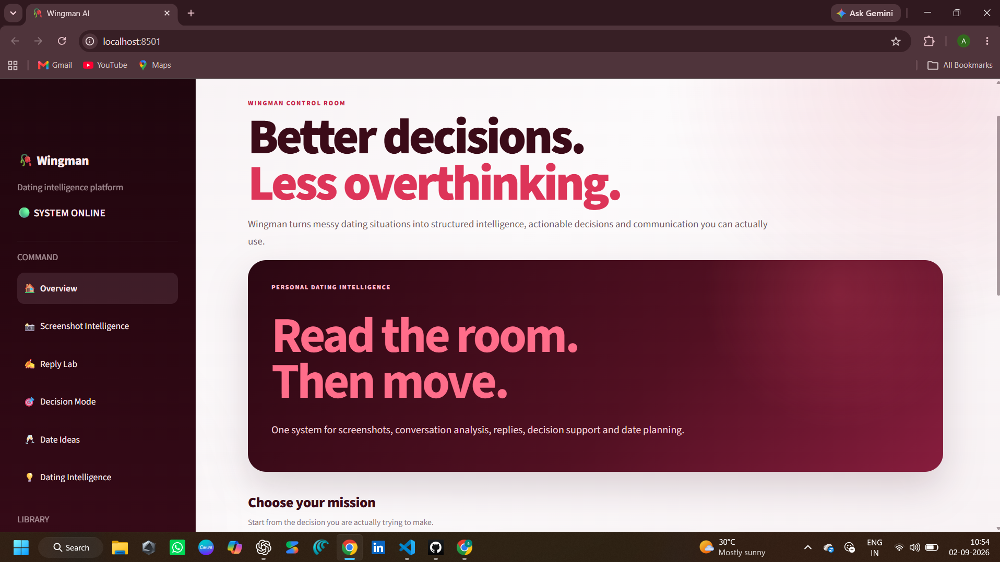
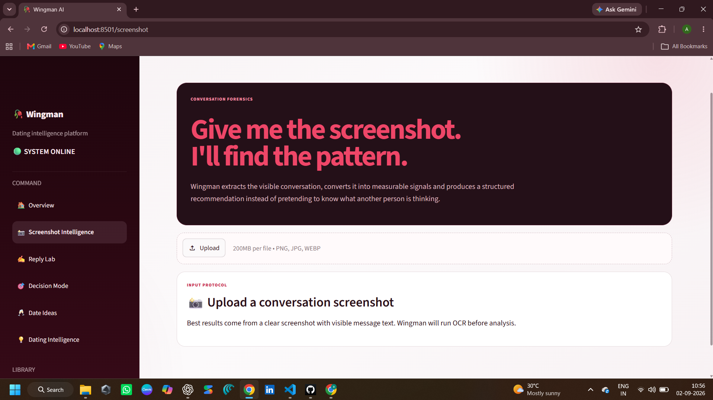
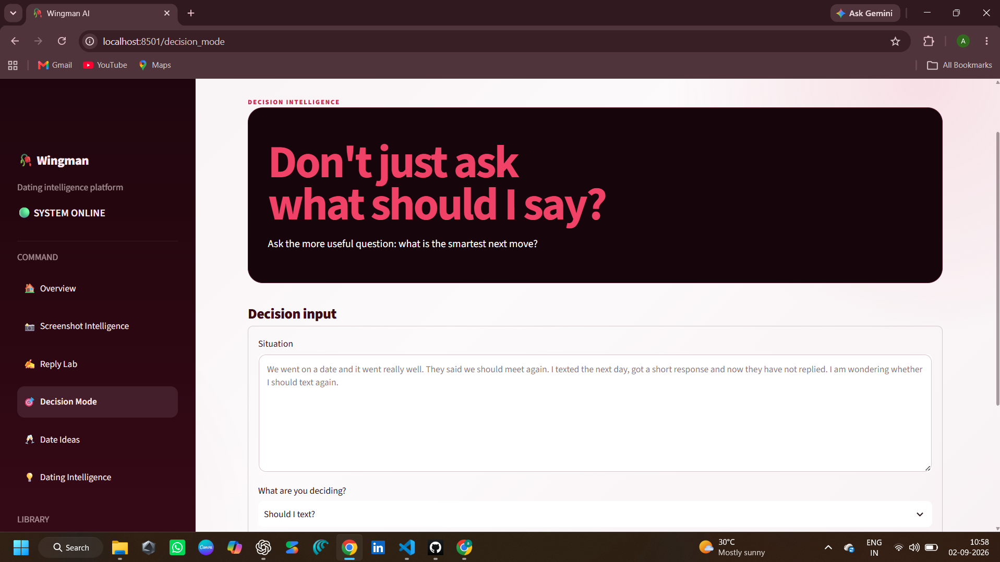
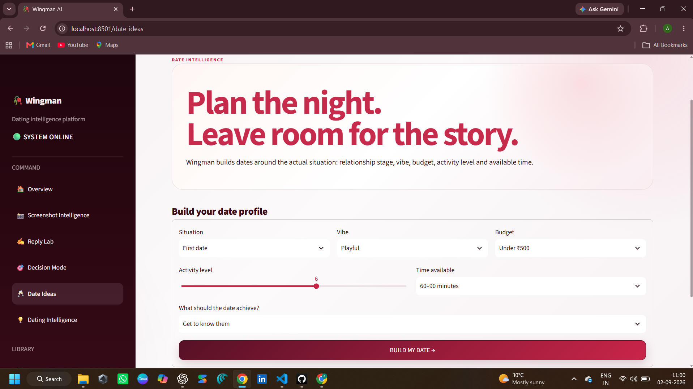

# 🥀 Wingman AI

> AI-powered dating intelligence for better conversations, smarter decisions, and better next moves.

Wingman AI is a modular dating intelligence platform that analyzes conversation screenshots, extracts interaction signals, retrieves relevant relationship guidance, and turns those signals into practical recommendations.

Instead of judging a conversation from a single message, Wingman looks at the broader interaction and considers signals such as warmth, reciprocity, engagement, flirt energy, message energy, and conversation direction.

The project combines **OCR, NLP, TF-IDF retrieval, cosine similarity, decision support, response strategies, date planning, and SQLite-based history** into one application.

Built collaboratively by **Aasveer Singh & Akshita Sharda**.

---

## ✨ Highlights

- 📸 Conversation screenshot analysis
- 🔎 OCR-powered text extraction
- 🧠 Conversation signal analysis
- 🧬 Conversation DNA insights
- 📚 Local RAG knowledge retrieval
- 🎯 Decision support for next steps
- ✍️ Reply strategy generation
- 🥂 Context-aware date ideas
- ❤️ Reply Vault
- 🕘 Conversation analysis history
- ⚡ FastAPI backend
- 🗄️ SQLite-based local storage
- 🖥️ Streamlit interface

---

## 📸 Product Demo

Wingman is built around multiple interfaces that turn conversation analysis into practical decision support.

### 🏠 Overview

The main Wingman interface provides access to the platform's core dating intelligence features.



---

### 📸 Screenshot Intelligence

Upload a conversation screenshot and analyze the interaction using OCR and conversation-signal processing.



---

### 🎯 Decision Mode

Decision Mode helps turn conversation context into a structured next-step recommendation.



---

### 🥂 Date Ideas

Generate structured date plans based on situation, vibe, budget, activity type, time, and objective.



---

## 🧠 How Wingman Works

Wingman is built around one simple idea:

> **Read patterns, not single messages.**

A conversation is analyzed through several stages:

```text
Conversation Screenshot
        ↓
       OCR
        ↓
  Text Extraction
        ↓
NLP Signal Analysis
        ↓
 Conversation DNA
        ↓
 Local Knowledge Retrieval
        ↓
  Decision Analysis
        ↓
 Recommended Next Move
---
